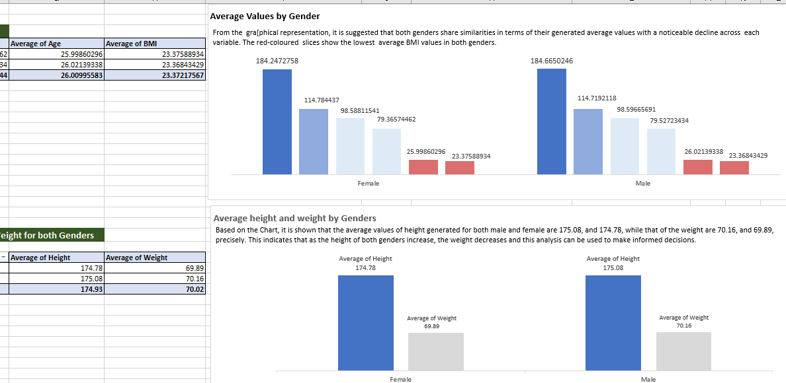
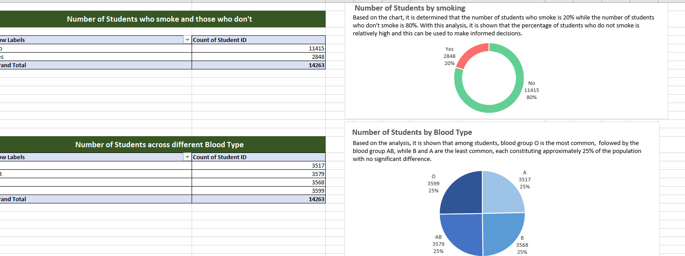

# Data Visualization

### Introduction:
The dataset provided encompasses a range of variables including; Student ID, Age, Gender, Height, Weight, Blood type, BMI, Temperature, Heart rate, blood pressure, cholesterol, diabetes,and smoking.
The objectives are to clean, analyze, and visualize data.
The aim is to uncover patterns, and valuable insights from the dataset.

### Pictoral presentation of the analysis:
The first image shows the avearge values and that of height and weight by gender

The second image shows the number of students by smoking and blood type

The third image shows the number of students by diabetes

### Conclusion:
In summary, the analysis of the student data has revealed significant insights. These insights encompass the prevalence of diabetes among students, the distribution of different blood type, the average values of students who smoke and those who do not, and the average height and weight values for both genders.

However, this analysis serves as valuable insights for guiding decisions in areas relating to the health and well-being of the student community. The insights can inform health decisions, educational programs, and policies aimed at enhancing the overall health and wellness of the student population.
